# How to create and debug simple FreeRTOS based application on STM32C5 MCU
In this example we will demonstrate how to create a basic example on NUCLEO-C562RE board which would use FreeRTOS and basic user interface elements (LED, button, UART simple messaging).

We will use HAL2 libraries during coding phase and during debug session we will demonstrate usage of FreeRTOS debug add-on.

## Example description
Application will run FreeRTOS with two active tasks which we will create:
- TaskA - responsible for LED toggling
- TaskB - responsible for sending consecutive number on UART (visible via VCOM)

Additionally there will be a binary semaphore which will be controlled (given) by the blue button press.
Semaphore will control LED blinking (start and stop it).

## Prerequisites for this session
In this session we will use:

As a hardware:
- NUCLEO-C562RE board
- USB TypeC cable
- PC with preinstalled software

As a software:
- STM32CubeMX2 for setting up our project and generation its skeleton
- STM32CubeIDE for VSCode for coding and debugging purposes
- any terminal application

It is recommended to keep both tools online in order to download proper set of the packs used for project generation

## Configuration part: STM32CubeMX2 tool

# Starting the new project
Open STM32CubeMX2 and start new project for selected MCU. In our case it will be STM32C562RET6.

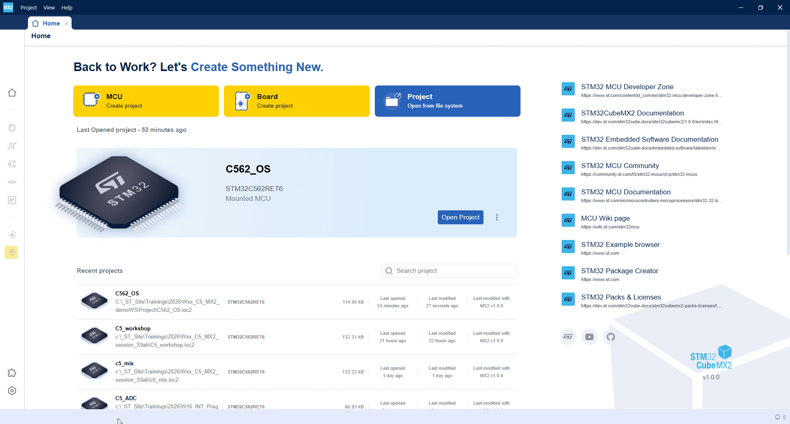

# Pinout selection
Within pinout select:
PA5 – as GPIO
PC13 – as GPIO

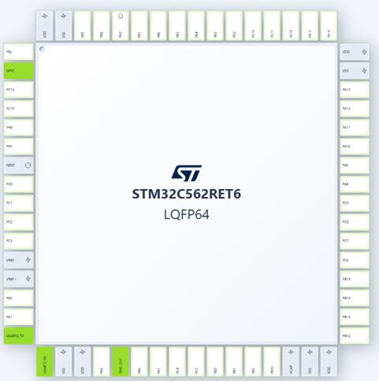

# Pins configuration
This step can be performed from Pinout view or later from GPIO peripheral configuration.
Let's use the second option

Once again click on PC13 and select "configured" option , then press "gear" icon to move to the configuration window.

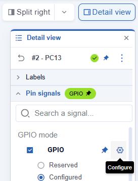

We will start from PA5 pin which is controlling Green LED.
- specify the label to "LED"
- change its mode to Output
keep rest of the settings in the default state

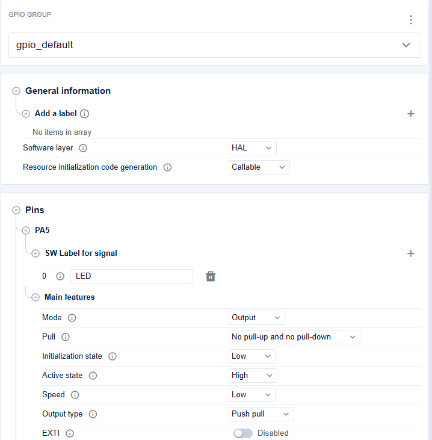

Now it is time for PC13 pin which is connected to the blue button.
- no need to change the basic configuration, nor setting the label
- enable EXTI mode
- specify the active edge (falling in our case)
- set EXTI mode to Interrupt
- enable NVIC 
- change priority from 0 to 5 (to match FreeRTOS settings)

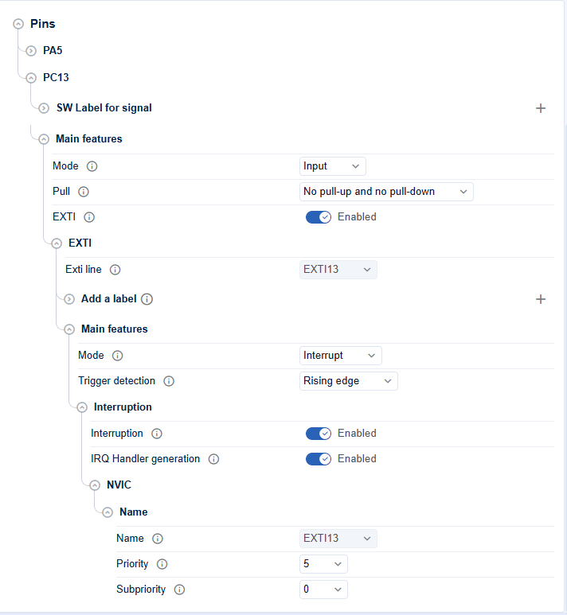

Now we have our basic IOs properly setup for the application.

# Clock configuration
We will keep a default clock configuration.

We will work on internal oscillator to reach 144MHz frequency for the core and most of the peripherals we will use

# USART2 configuration
On our board USART2 via pins PA2, PA3 is connected to on-board STLink and can be visible on PC as Virtual COM.
We will use this opportunity to send some data from one of tasks.
We need to activate USART2. We will use most of the default settings, 

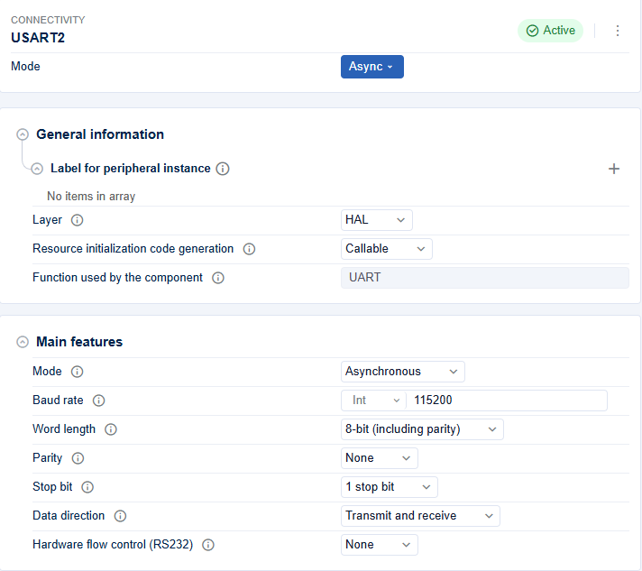

except pins selection.
USART2_TX - PA2
USART2_RX - PA3

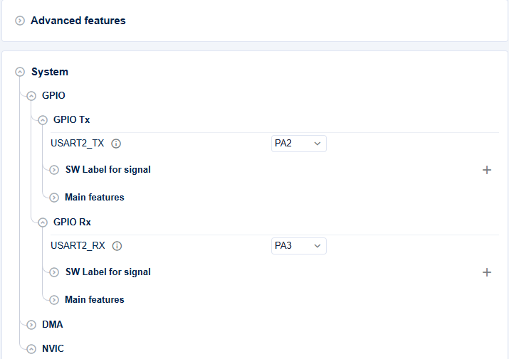

# Adding FreeRTOS
Let's switch to Middlewares section

Select FreeRTOS and activate it.

We can notice there is an issue reported. It is related to selection of SysTick for HAL library and OS tick which is not recommended.

Recommended action is to change the timebase for the HAL library (it is responsible for timeouts, delays within HAL functions).

To do this we need to swich to Peripherals section once again, go to timers section and select one of free timers. Less featured one is the good choice here (TIM6 or TIM7).
We just need to activate it.

You can follow below procedure:

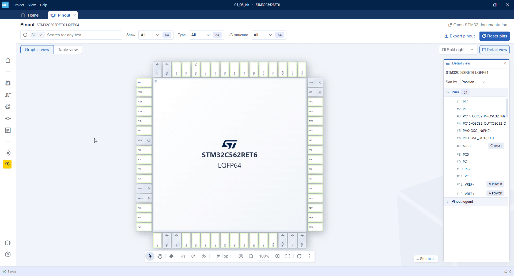

We will not change any default settings within its configuration, but it is recommended to do it in the final product to save FLASH/RAM resources by deactivation of OS elements which will not be used in our application.

In our case will just create two tasks and one binary semaphore.

Let's start from tasks.

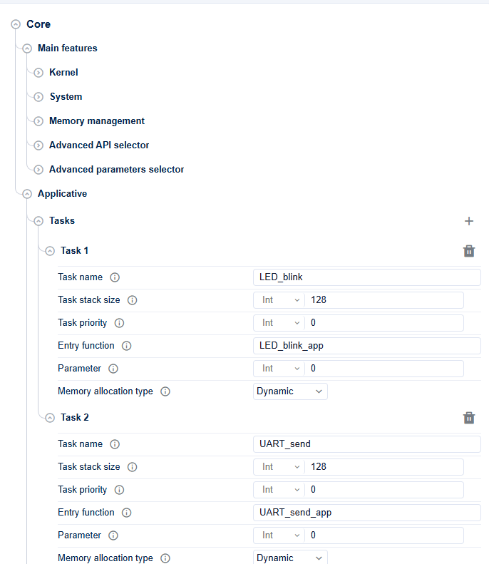

Now let's switch to Binary Semamphores

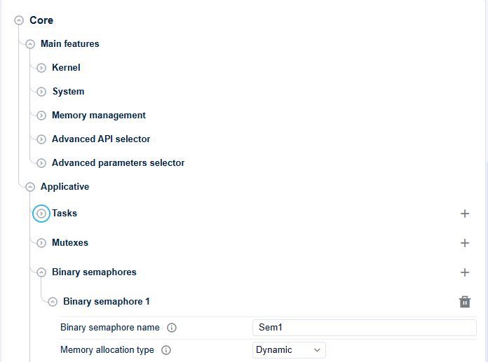

Now we are ready to generate our project and do some codig.

# Generating the project

Press on yellow icon.


Wait till the project will be generated and switch to VSCode with STM32CubeIDE plugin installed.


## Coding and debug part: VSCode with STM32CubeIDE plugin

Start VSCode.
Verify, whether you have installed STM32CubeIDE for VSCode

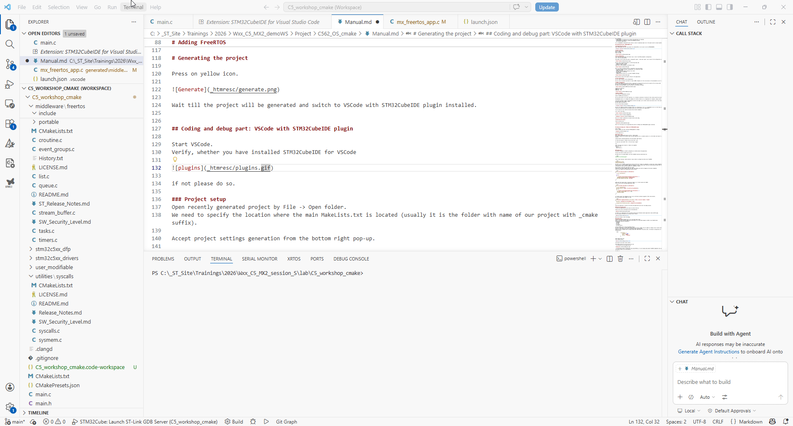

if not please do so.

### Project setup
Open recently generated project by File -> Open folder.
We need to specify the location where the main MakeLists.txt is located (usually it is the folder with name of our project with _cmake suffix).

Accept project settings generation from the bottom right pop-up.

In case you missed it, please click on the "bell" icon.

In case you click either "No" or "Do not show it again"

xxx

After the while your project is ready to be updated.
Open two files:
- main.c
- app_freertos.c


### Coding part
By default FreeRTOS is neither configured nor started within the application.

You will not find it within call of xxx

We need first to include header file with FreeRTOS functions deifinitions by:

```bash
#include "mx_freertos_app.h"
```

Then in main function, before while(1) loop we need to configure and then start FreeRTOS:

```bash
app_synctasks_init();
vTaskStartScheduler();
```
We need to call FreeRTOS configuration function which will create its components (2 tasks and 1 binary semaphore in our case).
Then we need to start FreeRTOS. Important message is that we should never land with code execution below this line as FreeRTOS is overtaking the code execution between its components (tasks).

Now we need to add some code within our tasks.
LED_blink task should toggle Green LED (PA5) each 200ms and could be stopped by the binary semaphore.
Thus we can organize this application code as below:

```bash
static void LED_blink_app(void *pvParameters)
{
  ( void ) pvParameters;

  for(;;)
  {
    /* Infinite loop executing LED_blink functionality. */
    xSemaphoreTake(Sem1_Handle, portMAX_DELAY);
    HAL_GPIO_TogglePin(LED_PORT, LED_PIN);
  }
}
```

UART_send task should send a consecutive number 0..9, 0 each second over USART2
Thus we can use the following application code:

```bash
static void UART_send_app(void *pvParameters)
{
  ( void ) pvParameters;
  hal_uart_handle_t *hUART = mx_usart2_uart_gethandle();
  for(;;)
  {
    /* Infinite loop executing UART_send functionality. */
    HAL_UART_Transmit(hUART, "a", 1, 10);
    vTaskDelay(1000);
  }
}
```

To release (give) the semaphore we will use an interrupt callback assigned to PC13 (blue button).
We can use below code snippet for that:

```bash
void HAL_EXTI_TriggerCallback(hal_exti_handle_t *hexti, hal_exti_trigger_t trigger)
{
  BaseType_t *pxHigherPriorityTaskWoken = NULL;

  xSemaphoreGiveFromISR(sem1_Handle, pxHigherPriorityTaskWoken);
}
```
Once the coding part is done we can build the application and strart the debug session.

### Build the application
To build the application we can save all active files by:

Then we can click on the Build icon on the bottom bar

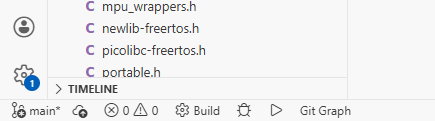

If there is no compilation error we should receive the information about application code and RAM usage.
We can display the details by clicking "piles" button:

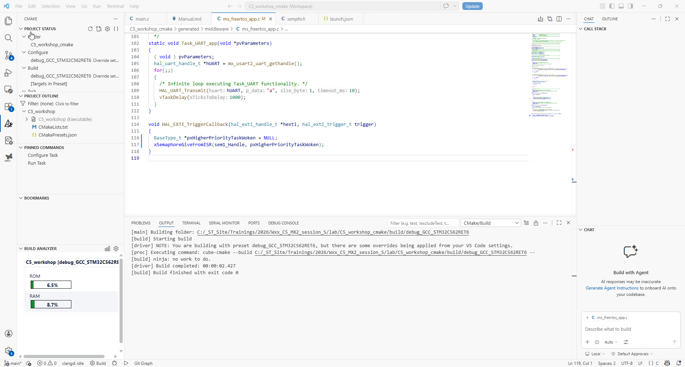

Now we are ready to start the debug

### Debug phase
Connect your NUCLEO-C562RE board to PC using USB TypeC cable.
Start an external terminal application and connect it to the COM assigned to VCOM of your NUCLEO board.
Specify the connection parameters:
- 115200bps
- 8b data
- 1b stop
- no parity
- no flow control

Click on debug icon to start the debug session.
We need to activate our RTOS debug plugin before we start a debug. We will update our debug script (called launch.json).
Click on "open launch.json file" to add RTOS plugin configuration.
Within the file, between other settings please add "RTOS Server" and press enter, the default configuration for FreeRTOS will be inserted automatically:

```bash
            "serverRtos": {
                "enabled": true,
                "port": "60000",
                "driver": "freertos"
            },
```

Save lanuch.json file.
Start debug session.

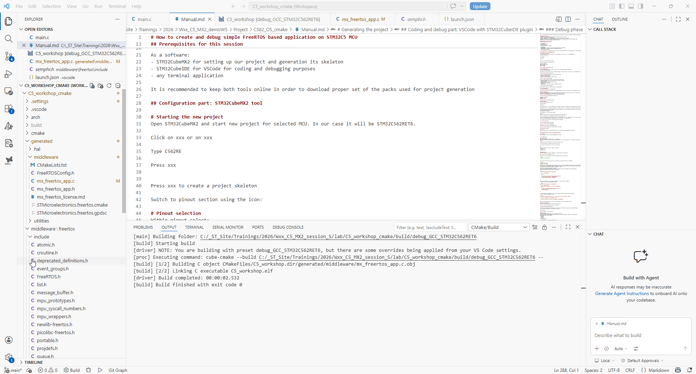

once done we can press "play" button.

Once debug session will be active we can see:
- on top small bar with debug control:

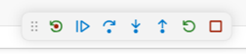

- on the bottom window an additional tab called RTOS-xxx. It will display data about FreeRTOS components once we pause the code execution (by default there is no live monitor).

To test it.
Start an application, after the wile pause it and see an effect on the board and in RTOS-0xxx window.

That's it. We can stop debug session, by pressing STOP icon


I hope you have been successfull following this description.
