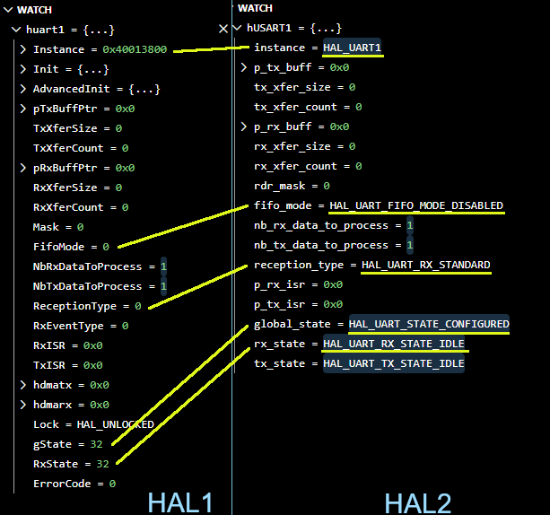
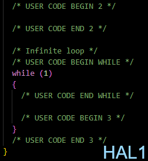
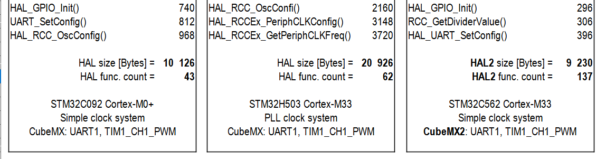

# STM32 HAL2 Drivers - brief overview
## Useful links
|Content|Link|
|-:|-|
| **Getting started** with STM32Cube **ecosystem**: <br>(development tools) | [https://stm32cubedocs-dev.st.com/stm32cube-docs/stm32cube-getting-started/1.1.1/en/index.html](https://stm32cubedocs-dev.st.com/stm32cube-docs/stm32cube-getting-started/1.1.1/en/index.html) |
| STM32Cube HAL2 - entry point: <br>(HAL2 documentation)| [https://dev.st.com/stm32cube-docs/stm32cubedocs-landing-page/en/index.html](https://dev.st.com/stm32cube-docs/stm32cubedocs-landing-page/en/index.html) |
|STM32Cube **Embedded SW** online documentation: |[https://dev.st.com/stm32cube-docs/embedded-software/2.0.0/en/index.html](https://dev.st.com/stm32cube-docs/embedded-software/2.0.0/en/index.html)|
|STM32 **HAL/LL Drivers** Documentation: |[https://dev.st.com/stm32cube-docs/stm32c5xx-hal-drivers/2.0.0/en/index.html](https://dev.st.com/stm32cube-docs/stm32c5xx-hal-drivers/2.0.0/en/index.html)|
|Configure your STM32Cube SW package with **STM32 Package Creator**: |[https://dev.st.com/stm32pc/](https://dev.st.com/stm32pc/)|
|Download specific example from **Example library**: |[https://dev.st.com/stm32-example-library/](https://dev.st.com/stm32-example-library/)|
|**GitHub repository** for STM32Cube embedded SW |[STMicroelectronics GitHub](https://github.com/stmicroelectronics) ( [STM32CubeC5](https://github.com/STMicroelectronics/STM32CubeC5) )|

## Rationale behind HAL2

Standard Periph. Lib. (**SPL**) [2007] ----> **HAL**(1) [2014] ----> **HAL2** [2026]

It is the evolution of the HAL1-based drivers (the same programming model and API style).

Resolve major known issues of HAL"1" which means:
- Improve performance & footprint
- Reinforce readability & conformity to C standards​ -> Higher quality
- Increase portability across STM32 lines
- Enhance integration with RTOSes
- Enhanced documentation
- Now CMSIS startup is in C – using ARM implementation
- HAL2 use natively LL inside function​

## HAL2 use natively LL inside HAL functions
[more details here](https://dev.st.com/stm32cube-docs/stm32c5xx-hal-drivers/2.0.0/en/docs/overview/hal_ll_layered_drivers.html#hal-and-ll-layered-drivers)

HAL1 and LL were more or less side by side (the LL was developed after the introduction of the HAL). HAL2 services now exclusively call LL functions instead of direct register access, improving driver maintenance and upgrades. Although some exceptions exists like CAN FD driver ([check other here](https://dev.st.com/stm32cube-docs/stm32c5xx-hal-drivers/2.0.0/en/docs/drivers/stm32c5xx_drivers_overview.html#stm32c5xx-drivers-overview)) which doesn't use LL driver.


HAL1 vs HAL2 - GPIO Initialization example:


HAL1 vs HAL2 - **LL** - GPIO Initialization example:


## Init vs SetConfig
[more details here](https://dev.st.com/stm32cube-docs/hal1-to-hal2-migration/1.0.0/en/docs/markup/drivers_documentation/breaking_concepts/breaking_concepts_concept_A.html)
- HAL_..._Init() - initializes handle structure and link instance - big difference in HAL1 - no more the same function.
- HAL_..._SetConfig() - configures peripheral registers
- separated configuration structures to save memory, faster. Not one heavy structure, not all features needed (save extra RAM footprint).
  - major/global configuration (e.g., UART)
  - additional sub-block configuration (e.g., TIM requires a global configuration and may also require at least one channel configuration if used in output or input compare mode) see [here](https://dev.st.com/stm32cube-docs/stm32c5xx-hal-drivers/2.0.0/en/docs/overview/hal_data_structure_and_types.html#hal-configuration-structures)

HAL1 Init() vs HAL2 Init() and SetConfig()-  example:


## No global handles
Each peripheral handle is static, defined in the dedicated mx_ .c file. The handle can be accessed using getter function.

example for mx_spi1.c:
```cpp
/* Handle for SPI1 */
static hal_spi_handle_t hSPI1;
...
hal_spi_handle_t *mx_spi1_gethandle(void)
{
  return &hSPI1;
}
```
... then either:
```cpp
hal_spi_handle_t *hspi1 = mx_spi1_gethandle();
HAL_SPI_TransmitReceive(hspi1, tx_buf, rx_buf, buf_size, HAL_MAX_DELAY);
```
or:
```cpp
HAL_SPI_TransmitReceive(mx_spi1_gethandle(), tx_buf, rx_buf, buf_size, HAL_MAX_DELAY);
```
## Better code handling and debuging
[more details here](https://dev.st.com/stm32cube-docs/stm32c5xx-hal-drivers/2.0.0/en/docs/overview/hal_data_structure_and_types.html#hal-parameter-types)

thanks to enumeration types:
- HAL1 uses macros for configuration values.
- HAL2 uses enumeration types instead.

(This applies for HAL layer only, LL remains using defines)


Debugging:



## *xxxx_MspInit()* or *xxxx_hal_msp.c* not used any more
[more details here](https://dev.st.com/stm32cube-docs/hal1-to-hal2-migration/1.0.0/en/docs/markup/drivers_documentation/breaking_concepts/breaking_concepts_concept_L.html#remove-the-global-msp-file)

Weak MSP (*MCU Support Package*) initialization function are not used anymore and xxxx_hal_msp.c file is not generated.

All the initialization including GPIO, clocks... is in the **dedicated mx_xxxxx.c file**

The mx_ .c file also contains interrupt handler. The file stm32xxx_it.c was also removed.


## No user sections in the code
This detail is related to code generation.
MX2 never touch files outside **generated/** folder.



## User data feature
[more details here](https://dev.st.com/stm32cube-docs/stm32c5xx-hal-drivers/2.0.0/en/docs/overview/hal_drivers_apis.html#setting-and-getting-user-data)

Once the feature is enabled, it allows to associate user object (variable, structure,...) with peripheral handle using *HAL_PPP_SetUserData(...)* and *HAL_PPP_GetUserData(...)* functions.


## Improved footprint
HAL vs HAL2 drivers comparision

Three project generated by CubeMX/CubeMX2 (STM32C0, STM32H5, STM32C5):
- USART1 asynchronous mode
- TIM1 CH1 PWM

- Comparing only HAL drivers, not application sources.
- Linker file adjusted to have the same amount for flash and SRAM memory for better comparison in build output.


Result:
- HAL2 has **more functions** which are **smaller**.
- HAL2 produces overall **smaller memory footprint** of the application.

More details:

