## STM32C5_Demo_Workshop : STM32CubeMX2 new features
The purpose of this hands-on is to use "Code Preview" to add a functionality to an existing project without regenerating the code. By following the steps outlined below, user will learn how this feature improve efficiency.

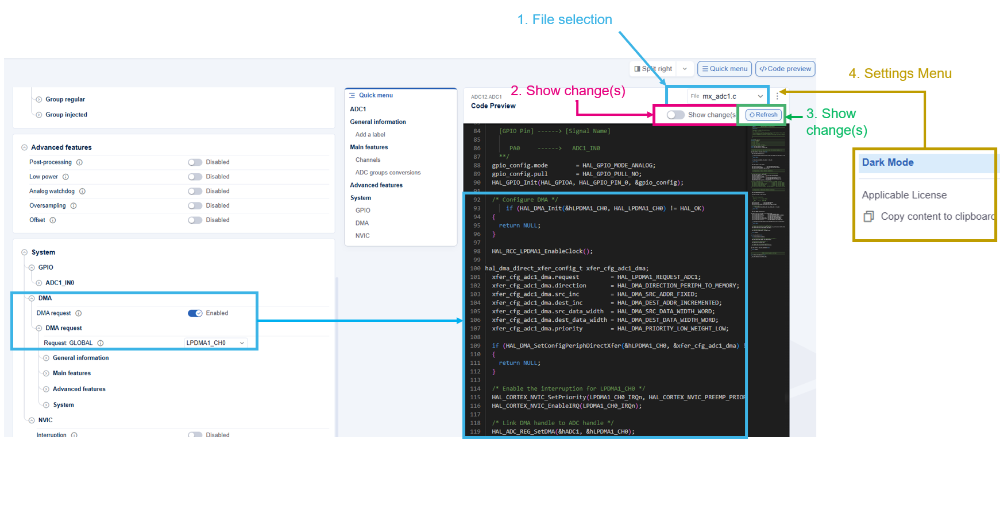
## Prerequisites

- STM32CubeMX2 1.0.0 
- VSCode (with STM32Cube for VSCode extension)
- Nucleo-C562RE
- USB type C cable

# STM32CubeMX2 1.0.0
## Code Preview
Let's discover one of the eventual usage of the "Code preview" feature.

Use case : From an existing project, how can I associate the ADC with a DMA transfert feature without regenerating the code?

To answer to this question, we'll follow the steps below:

## 1. Open the .IOC2 file of your project via STM32CubeMX2 

 - Run STM32CubeMX2 1.0.0

### 1.1. Open existing project from file system
  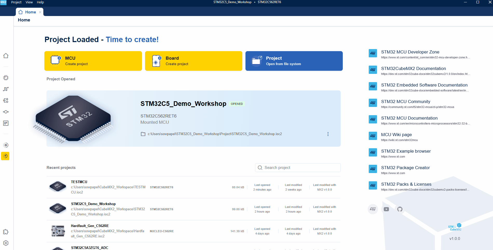
### 1.2. Go to peripheral section , click on "ADC12 - ADC1" and enable the DMA request
  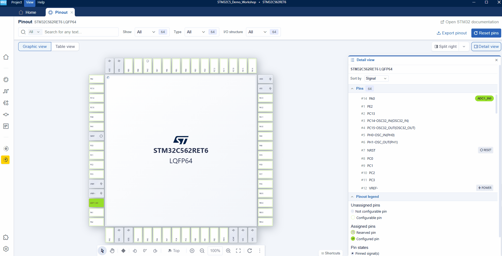
### 1.3. Click on "Code preview" section
  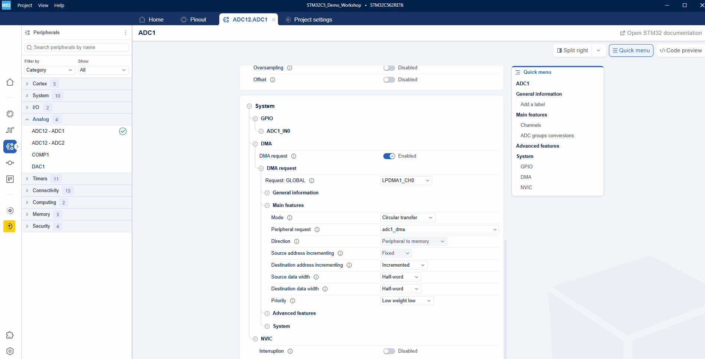
# 2. Open VSCode and copy the sections related to the DMA configuration in the project
### 2.1. Copy & paste DMA handlers
   Code : copy the code below in the file mx_adc1.c
   ```c
   static hal_dma_node_t DMA_Node_ADC1;
   static hal_dma_handle_t hLPDMA1_CH0;
   ```
  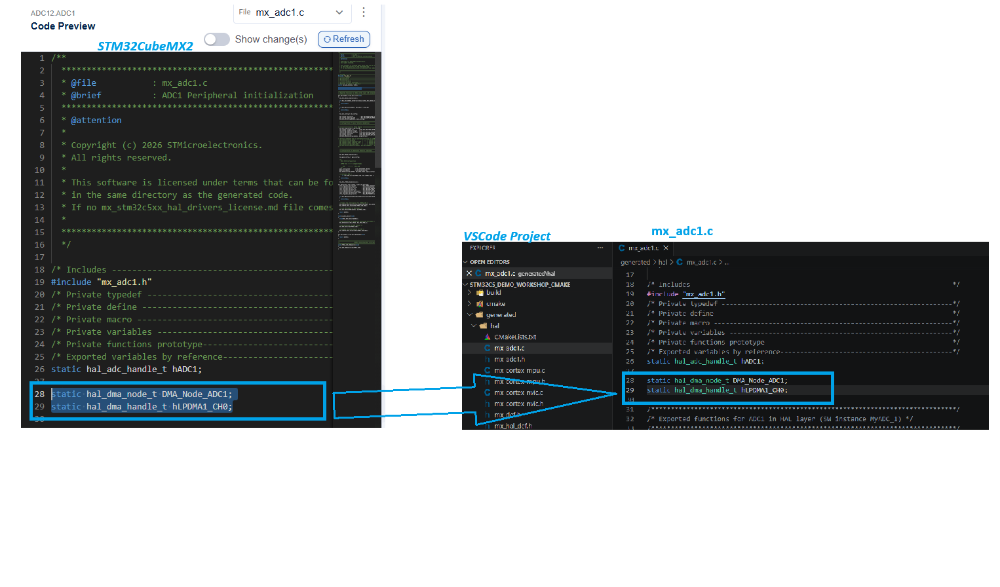
### 2.2. Copy & paste DMA initialization section 
  Code : copy the code below in the file mx_adc1.c
   ```c
   hal_adc_handle_t *mx_adc1_init(void)
  {....
  /* Configure DMA */
  if (HAL_DMA_Init(&hLPDMA1_CH0, HAL_LPDMA1_CH0) != HAL_OK)
  {
    return NULL;
  }

  HAL_RCC_LPDMA1_EnableClock();
  
  hal_dma_direct_xfer_config_t xfer_cfg_adc1_dma;
  xfer_cfg_adc1_dma.request         = HAL_LPDMA1_REQUEST_ADC1;
  xfer_cfg_adc1_dma.direction       = HAL_DMA_DIRECTION_PERIPH_TO_MEMORY;
  xfer_cfg_adc1_dma.src_inc         = HAL_DMA_SRC_ADDR_FIXED;
  xfer_cfg_adc1_dma.dest_inc        = HAL_DMA_DEST_ADDR_INCREMENTED;
  xfer_cfg_adc1_dma.src_data_width  = HAL_DMA_SRC_DATA_WIDTH_HALFWORD;
  xfer_cfg_adc1_dma.dest_data_width = HAL_DMA_DEST_DATA_WIDTH_HALFWORD;
  xfer_cfg_adc1_dma.priority        = HAL_DMA_PRIORITY_LOW_WEIGHT_LOW;

  if (HAL_DMA_SetConfigPeriphLinkedListCircularXfer(&hLPDMA1_CH0, &DMA_Node_ADC1, &xfer_cfg_adc1_dma) != HAL_OK)
  {
    return NULL;
  }

  /* Enable the interruption for LPDMA1_CH0 */
  HAL_CORTEX_NVIC_SetPriority(LPDMA1_CH0_IRQn, HAL_CORTEX_NVIC_PREEMP_PRIORITY_0, HAL_CORTEX_NVIC_SUB_PRIORITY_0);
  HAL_CORTEX_NVIC_EnableIRQ(LPDMA1_CH0_IRQn);

  /* Link DMA handle to ADC handle */
  HAL_ADC_REG_SetDMA(&hADC1, &hLPDMA1_CH0);
  ...}
   ```
  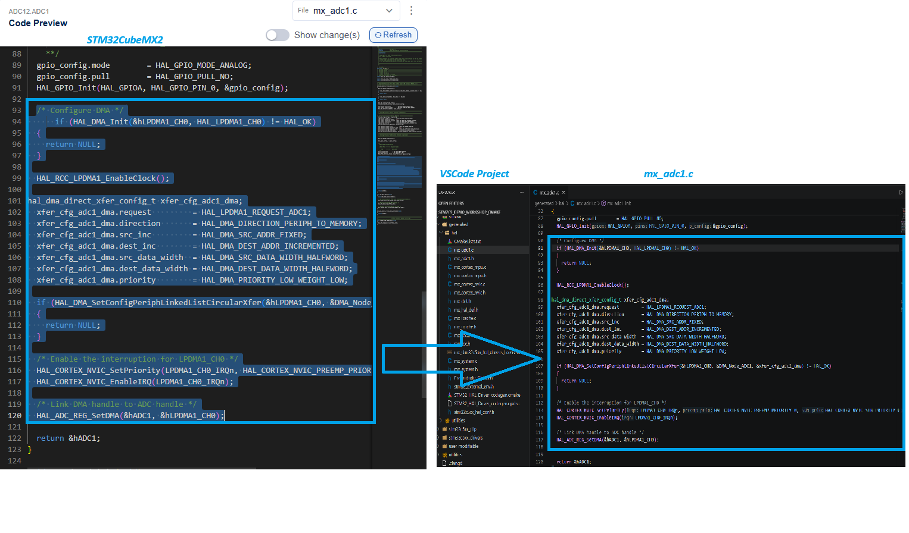
### 2.3  Copy & paste DMA de-initialization section
  Code : copy the code below in the file mx_adc1.c
  ```c
  void mx_adc1_deinit(void)
  {...
      /* De-initialize the DMA channel */
      HAL_DMA_DeInit(&hLPDMA1_CH0);

      /* Disable the interruption for DMA */
      HAL_CORTEX_NVIC_DisableIRQ(LPDMA1_CH0_IRQn);
  }
  ```
  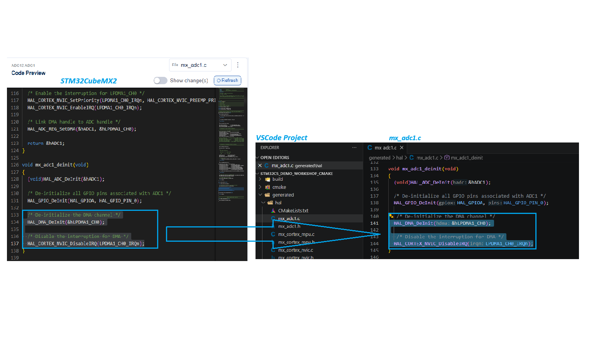
### 2.4  Copy & paste LPDMA1 channel0 handler function implementation
  Code : copy the code below in the file mx_adc1.c
  ```c
  void LPDMA1_CH0_IRQHandler(void)
  {
    HAL_DMA_IRQHandler(&hLPDMA1_CH0);
  }
  ```
  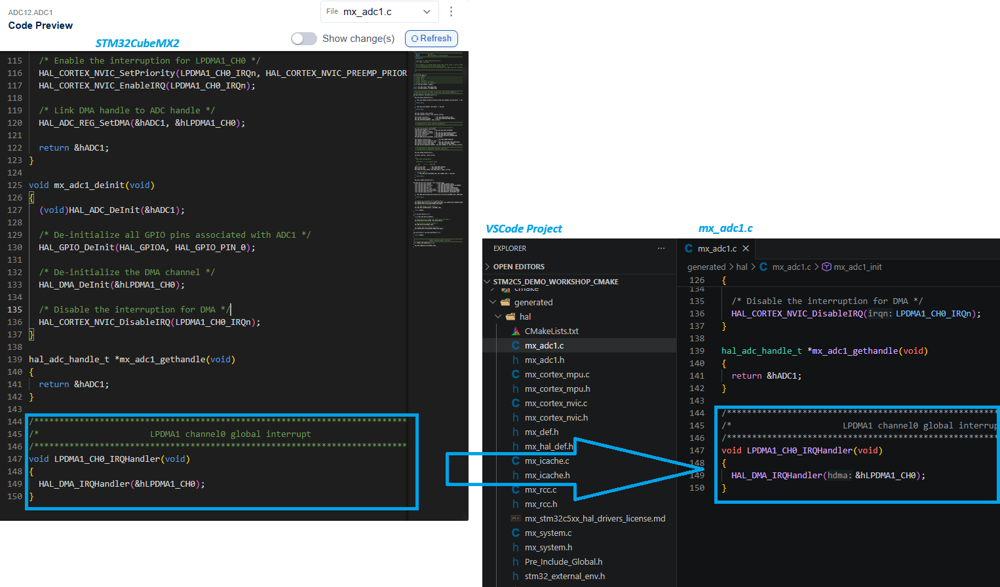
### 2.5 Add LPDMA1 channel0 handler function declaration in the mx_adc1.h file
  Code : copy the code below in the file mx_adc1.h
  ```c
  /******************************************************************************/
  /*                      LPDMA1 channel0 global interrupt                      */
  /******************************************************************************/
  void LPDMA1_CH0_IRQHandler(void);
  ```
  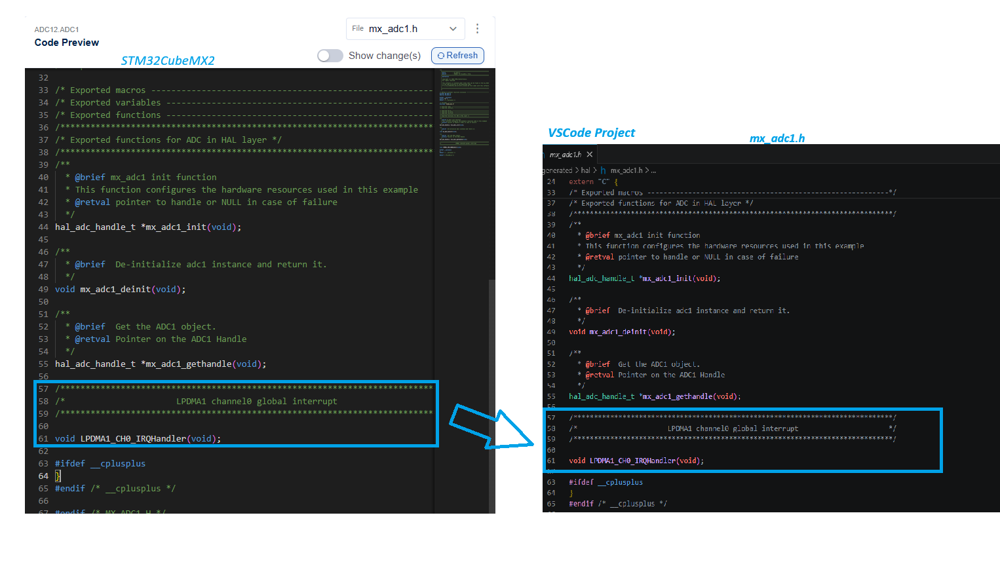
### 2.6 Enable HAL DMA driver in the configuration file "stm32c5xx_hal_conf.h"
  - Set ``` USE_HAL_DMA  ``` to 1U in the file "stm32C5xx_hal_conf.h"

  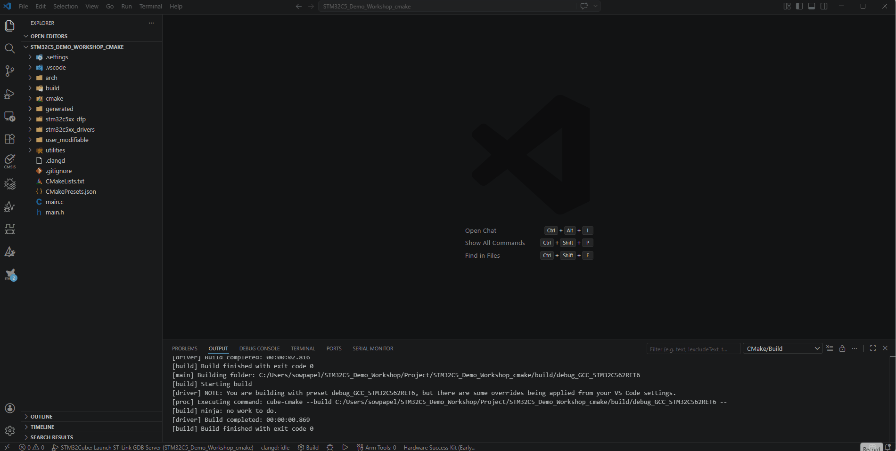
### 2.7 Enable HAL DMA LINKEDLIST driver in the configuration file "stm32c5xx_hal_conf.h"
  - Set ``` USE_HAL_DMA_LINKEDLIST  ``` to 1U in the file "stm32C5xx_hal_conf.h"
  
  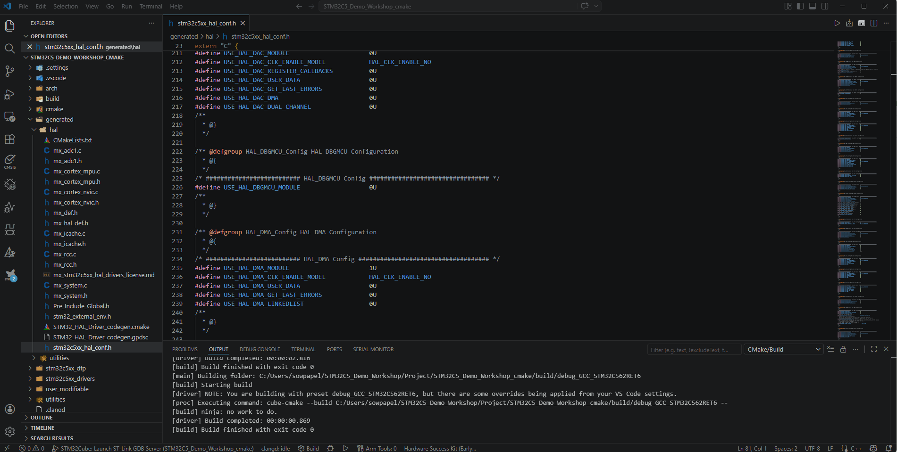
## 3. Compile and download to the target
  - connect the Nucleo-C562RE CN1(USB STLINK) to your PC

  - connect the Pin A0 to an input voltage
    
    
  - launch `Compile and program the Target`
    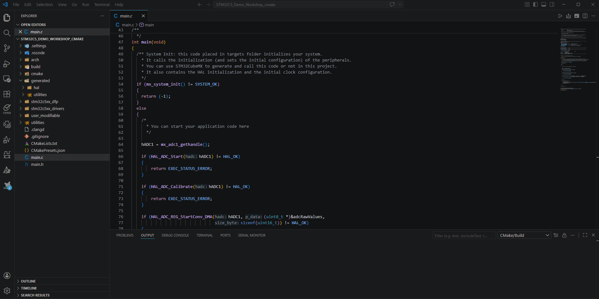
